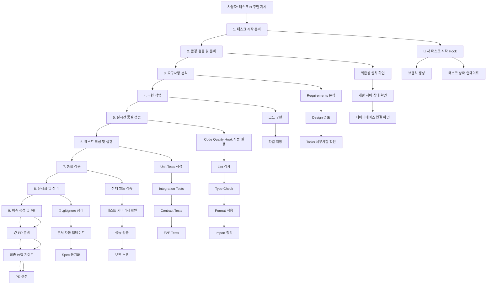

# 강화된 태스크 구현 워크플로우

## 🚀 완전한 태스크 구현 플로우

### **사용자 지시: "태스크 N 구현해줘"**



## 📋 **단계별 상세 워크플로우**

### **1단계: 태스크 시작 준비** 🚀

```bash
# 자동 실행: "🚀 새 태스크 시작" Hook
```

- ✅ Git 브랜치 생성 (`feature/task-N-{설명}`)
- ✅ GitHub 이슈 생성 및 연결
- ✅ Tasks.md 상태 업데이트 (`in_progress`)
- ✅ 작업 환경 초기화

### **2단계: 환경 검증 및 준비** 🔧

```bash
# 자동 검증
pnpm install --frozen-lockfile
docker-compose ps
pnpm db:generate
```

- ✅ **의존성 설치 확인**: `node_modules` 최신 상태 확인
- ✅ **개발 서버 상태**: Docker 서비스 (Redis, MinIO, MailHog) 실행 확인
- ✅ **데이터베이스 연결**: Prisma 클라이언트 생성 및 연결 테스트
- ✅ **환경 변수**: 필요한 `.env` 파일 존재 확인

### **3단계: 요구사항 분석** 📖

- ✅ **Requirements 문서**: 해당 태스크의 요구사항 상세 분석
- ✅ **Design 문서**: 관련 아키텍처 및 설계 검토
- ✅ **Tasks 세부사항**: 구현해야 할 작업 목록 및 완료 조건 확인
- ✅ **의존성 분석**: 다른 패키지/모듈과의 연관성 파악

### **4단계: 구현 작업** 💻

- ✅ **코드 작성**: 요구사항에 따른 실제 구현
- ✅ **점진적 개발**: 작은 단위로 나누어 구현
- ✅ **컨벤션 준수**: 코딩 스타일 및 네이밍 컨벤션 적용

### **5단계: 실시간 품질 검증** ⚡

```bash
# 파일 저장 시마다 자동 실행: Code Quality Hook
```

- ✅ **ESLint 검사**: `pnpm eslint .`
  - 코드 스타일 규칙 준수
  - 잠재적 버그 패턴 감지
  - Import/Export 규칙 확인
  - Next.js 특화 규칙 적용
- ✅ **TypeScript 타입 체크**: `pnpm type-check`
  - 타입 안정성 검증
  - 인터페이스 일치성 확인
  - 제네릭 타입 검증
- ✅ **코드 포맷팅**: `pnpm format`
  - Prettier 규칙 적용
  - 일관된 코드 스타일 유지
- ✅ **Import 정리**:
  - 사용하지 않는 import 제거
  - Import 순서 정리
  - 상대/절대 경로 일관성

### **6단계: 테스트 작성 및 실행** 🧪

```bash
# 태스크 완료 시 자동 실행: Task Completion Tests Hook
```

- ✅ **Unit Tests**: 개별 함수/컴포넌트 테스트
- ✅ **Integration Tests**: 모듈 간 상호작용 테스트
- ✅ **Contract Tests**: API 스펙 준수 테스트 (API 관련 태스크)
- ✅ **E2E Tests**: 사용자 시나리오 테스트 (주요 기능)
- ✅ **Database Tests**: 스키마, 쿼리, 성능 테스트 (DB 관련 태스크)

### **7단계: 통합 검증** 🔍

```bash
# 전체 시스템 검증
pnpm build
pnpm test:coverage
pnpm db:validate  # DB 관련 태스크
```

- ✅ **빌드 검증**: 전체 프로젝트 빌드 성공 확인
- ✅ **테스트 커버리지**: 70% 이상 달성 확인
- ✅ **성능 검증**: 응답 시간, 메모리 사용량 확인
- ✅ **보안 스캔**: 취약점 및 민감 정보 노출 검사
- ✅ **데이터베이스 검증**: 스키마 무결성 및 쿼리 성능 (해당 시)

### **8단계: 문서화 및 정리** 📝

```bash
# 수동 실행: "🧹 .gitignore 정리" Hook
```

- ✅ **.gitignore 정리**: 불필요한 파일 패턴 추가
- ✅ **Tasks.md 업데이트**: 완료 체크 및 추가 작업 기입
- ✅ **Spec 동기화**: Requirements, Design, Tasks 일관성 확인
- ✅ **README 업데이트**: 새로운 기능이나 설정 방법 추가
- ✅ **API 문서**: API 관련 태스크의 경우 문서 자동 생성

### **9단계: 이슈 생성 및 PR** 🎯

```bash
# 수동 실행: "📋 PR 준비" Hook
```

- ✅ **.gitignore 재검증**: 누락된 파일 최종 확인
- ✅ **품질 게이트 통과**:
  ```bash
  pnpm eslint .      # ✓ 린트 에러 0개
  pnpm type-check    # ✓ 타입 에러 0개
  pnpm test:ci       # ✓ 모든 테스트 통과
  pnpm build         # ✓ 빌드 성공
  ```
- ✅ **커버리지 확인**: 70% 이상 달성
- ✅ **이슈 템플릿 작성**: `issue-template.md` 파일에 태스크 내용 정리
- ✅ **GitHub CLI 명령어 제공**: 사용자가 수동으로 이슈 생성
- ✅ **커밋 정리**: 컨벤션에 맞는 커밋 메시지
- ✅ **브랜치 푸시**: 원격 저장소에 브랜치 업로드
- ✅ **PR CLI 명령어 제공**: 사용자가 수동으로 PR 생성

## 🚨 **품질 게이트 (Quality Gates)**

### **실시간 게이트** (파일 저장 시)

```bash
❌ ESLint 에러 → 즉시 수정 필요
❌ TypeScript 에러 → 즉시 수정 필요
⚠️  Warning → 검토 후 수정 권장
```

### **중간 게이트** (구현 완료 시)

```bash
❌ 테스트 실패 → 구현 재검토
❌ 커버리지 < 70% → 테스트 추가
❌ 빌드 실패 → 의존성 및 설정 확인
```

### **최종 게이트** (PR 생성 전)

```bash
❌ 모든 품질 검사 통과 필수
❌ 문서화 완료 필수
❌ .gitignore 정리 완료 필수
```

## 🔄 **자동화 vs 수동 개입**

### **완전 자동화** (사용자 개입 없음)

- 환경 검증
- 요구사항 분석
- 코드 구현
- 실시간 품질 검증
- 테스트 작성
- 통합 검증

### **반자동화** (확인 후 진행)

- .gitignore 정리
- 문서 업데이트
- PR 생성

### **수동 트리거** (사용자 선택)

- 중간 검증 포인트
- 단계별 진행 확인
- 최종 승인

## 📊 **예상 소요 시간 (개선된)**

| 태스크 복잡도         | 구현 시간 | 검증 시간 | 총 시간   | 자동화 비율 |
| --------------------- | --------- | --------- | --------- | ----------- |
| 간단 (설정, 유틸리티) | 5-10분    | 5-10분    | 10-20분   | 95%         |
| 보통 (API, 컴포넌트)  | 20-40분   | 10-20분   | 30-60분   | 90%         |
| 복잡 (실시간 기능)    | 60-90분   | 20-30분   | 1.5-2시간 | 85%         |

## 🎯 **추가 개선 사항**

### **1. 성능 모니터링**

- 빌드 시간 추적
- 테스트 실행 시간 모니터링
- 메모리 사용량 체크

### **2. 보안 강화**

- 의존성 취약점 스캔
- 민감 정보 노출 검사
- 코드 보안 패턴 검증

### **3. 협업 지원**

- 코드 리뷰 체크리스트 자동 생성
- 변경 사항 영향도 분석
- 팀원 알림 및 멘션

### **4. 지속적 개선**

- 워크플로우 성능 메트릭 수집
- 병목 지점 식별 및 최적화
- 사용자 피드백 반영

---

**결론**: 이제 **품질 검증이 강화된 완전한 워크플로우**가 구축되어, 사용자는 **"태스크 N 구현해줘"** 한 마디로 **고품질의 완성된 기능**을 얻을 수 있습니다! 🚀
