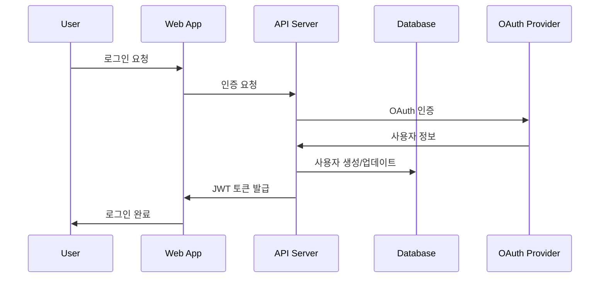
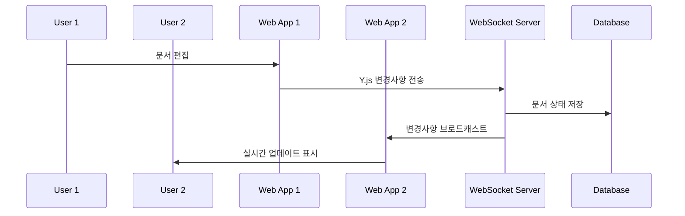
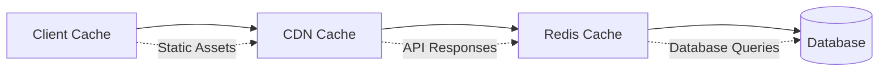

# 시스템 아키텍처 개요

## 📋 전체 시스템 구조

```mermaid
graph TB
    subgraph "클라이언트 레이어"
        WEB[Next.js Web App]
        MOBILE[모바일 앱 (미래)]
    end
    
    subgraph "API 게이트웨이"
        NGINX[NGINX Load Balancer]
    end
    
    subgraph "애플리케이션 레이어"
        API[REST API Server]
        WS[Hocuspocus WebSocket Server]
        WEB_SERVER[Next.js Server]
    end
    
    subgraph "데이터 레이어"
        DB[(PostgreSQL)]
        REDIS[(Redis Cache)]
        S3[(S3/MinIO Storage)]
    end
    
    subgraph "외부 서비스"
        AUTH[OAuth Providers]
        EMAIL[Email Service]
        AI[OpenAI API]
    end
    
    WEB --> NGINX
    MOBILE --> NGINX
    NGINX --> API
    NGINX --> WS
    NGINX --> WEB_SERVER
    
    API --> DB
    API --> REDIS
    API --> S3
    WS --> DB
    WS --> REDIS
    
    WEB_SERVER --> AUTH
    API --> EMAIL
    API --> AI
```

## 🏗️ 모노레포 구조

```
mini-notion-app/
├── apps/
│   ├── web/          # Next.js 클라이언트 애플리케이션
│   ├── api/          # REST API 서버 (Express.js)
│   └── server/       # Hocuspocus WebSocket 서버
├── packages/
│   ├── ui/           # 공통 UI 컴포넌트 라이브러리
│   ├── editor/       # Tiptap 에디터 로직
│   ├── collaboration/# Y.js 협업 로직
│   ├── auth/         # 인증 및 권한 관리
│   ├── database/     # Prisma 스키마 및 DB 유틸리티
│   ├── types/        # TypeScript 타입 정의
│   └── config/       # 공통 설정 (ESLint, Prettier, etc.)
└── docs/             # 프로젝트 문서
```

## 🔄 데이터 플로우

### 1. 사용자 인증 플로우


### 2. 실시간 협업 플로우


## 🛠️ 기술 스택

### 프론트엔드
- **Framework**: Next.js 15.1.3
- **UI Library**: React 18.3.1
- **Styling**: Tailwind CSS
- **State Management**: Zustand
- **Editor**: Tiptap
- **Real-time**: Y.js + Hocuspocus Provider

### 백엔드
- **API Server**: Express.js
- **WebSocket Server**: Hocuspocus
- **Authentication**: NextAuth.js
- **Database ORM**: Prisma
- **Validation**: Zod

### 데이터베이스
- **Primary DB**: PostgreSQL (운영), SQLite (개발)
- **Cache**: Redis
- **File Storage**: AWS S3 (운영), MinIO (개발)

### DevOps
- **Monorepo**: Turbo + pnpm
- **CI/CD**: GitHub Actions
- **Containerization**: Docker
- **Orchestration**: Kubernetes (운영)

## 🔐 보안 아키텍처

### 인증 및 권한
- **인증**: JWT + NextAuth.js
- **MFA**: TOTP (Google Authenticator 호환)
- **권한**: 5단계 RBAC (Owner, Admin, Editor, Viewer, Guest)
- **세션**: Redis 기반 세션 관리

### 데이터 보호
- **전송 암호화**: TLS 1.3
- **저장 암호화**: 데이터베이스 및 파일 저장소 암호화
- **민감 정보**: 개별 필드 암호화 (MFA 시크릿 등)

## 📊 성능 및 확장성

### 캐싱 전략


### 수평 확장
- **API 서버**: 무상태 설계로 수평 확장 가능
- **WebSocket 서버**: Redis Pub/Sub으로 클러스터링
- **데이터베이스**: 읽기 복제본 및 샤딩 지원
- **파일 저장소**: S3 기반 무제한 확장

## 🔍 모니터링 및 관찰성

### 메트릭 수집
- **애플리케이션 메트릭**: Prometheus
- **시스템 메트릭**: Node Exporter
- **비즈니스 메트릭**: 커스텀 메트릭

### 로깅
- **구조화된 로깅**: JSON 형식
- **로그 수집**: Fluentd/Fluent Bit
- **로그 저장**: Elasticsearch
- **로그 시각화**: Kibana

### 추적
- **분산 추적**: Jaeger
- **에러 추적**: Sentry
- **성능 모니터링**: New Relic (선택적)

## 🚀 배포 아키텍처

### 개발 환경
```yaml
services:
  web:
    build: ./apps/web
    ports: ["3000:3000"]
  
  api:
    build: ./apps/api
    ports: ["3001:3001"]
  
  server:
    build: ./apps/server
    ports: ["1234:1234"]
  
  postgres:
    image: postgres:15
    ports: ["5432:5432"]
  
  redis:
    image: redis:7
    ports: ["6379:6379"]
  
  minio:
    image: minio/minio
    ports: ["9000:9000", "9001:9001"]
```

### 프로덕션 환경
```yaml
# Kubernetes 배포
apiVersion: apps/v1
kind: Deployment
metadata:
  name: mini-notion-web
spec:
  replicas: 3
  selector:
    matchLabels:
      app: mini-notion-web
  template:
    spec:
      containers:
      - name: web
        image: mini-notion/web:latest
        ports:
        - containerPort: 3000
        env:
        - name: DATABASE_URL
          valueFrom:
            secretKeyRef:
              name: db-secret
              key: url
```

## 📈 성능 목표

### 응답 시간
- **API 응답**: < 200ms (95th percentile)
- **페이지 로드**: < 2초 (First Contentful Paint)
- **실시간 동기화**: < 100ms (지연 시간)

### 처리량
- **동시 사용자**: 10,000명
- **API 요청**: 10,000 RPS
- **WebSocket 연결**: 5,000개 동시 연결

### 가용성
- **시스템 가용성**: 99.9% (월 43분 다운타임)
- **데이터 내구성**: 99.999999999% (11 9's)
- **백업 복구**: RTO 4시간, RPO 1시간

## 🔄 데이터 일관성

### ACID 속성
- **원자성**: 트랜잭션 기반 데이터 변경
- **일관성**: 외래 키 제약 조건 및 비즈니스 규칙
- **격리성**: 적절한 격리 수준 설정
- **지속성**: WAL 기반 데이터 지속성

### 실시간 동기화
- **CRDT**: Y.js 기반 충돌 없는 복제 데이터 타입
- **이벤트 소싱**: 문서 변경 이력 추적
- **최종 일관성**: 분산 환경에서의 일관성 보장

---

**참고**: 시스템 아키텍처는 사용자 증가와 기능 확장에 따라 지속적으로 진화합니다.