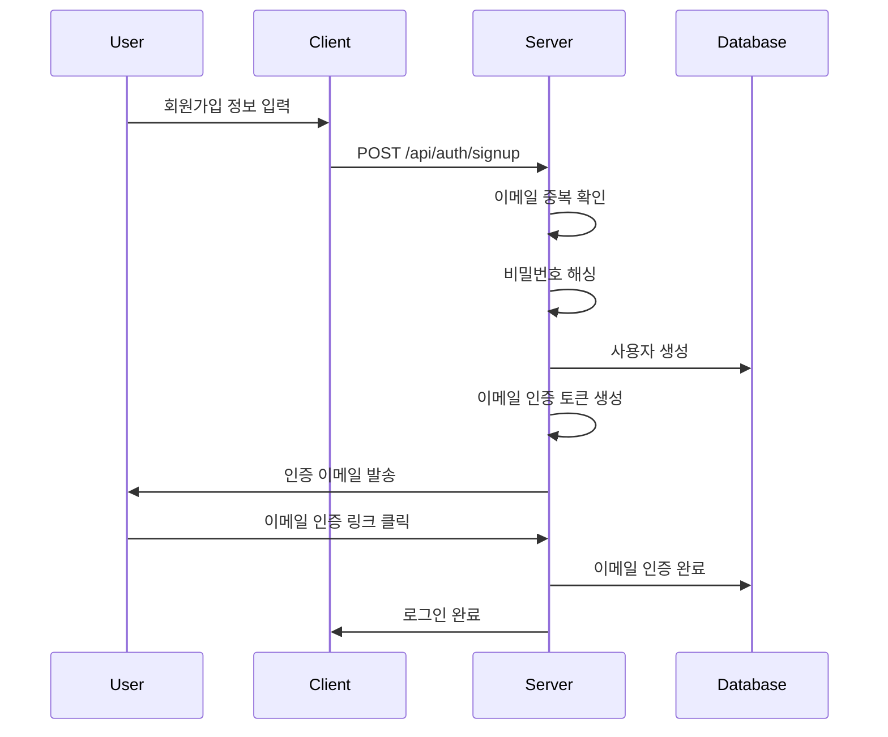
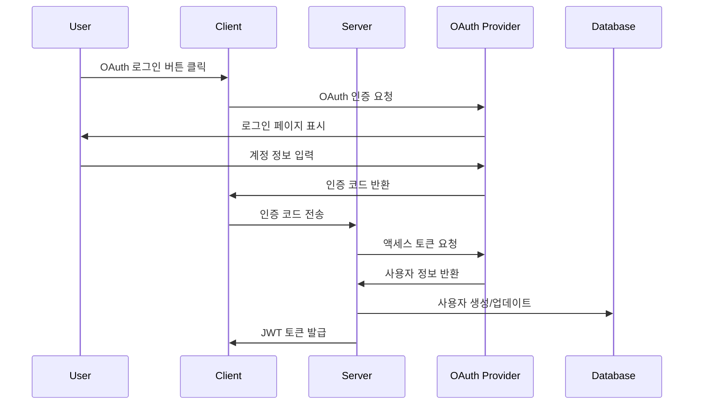
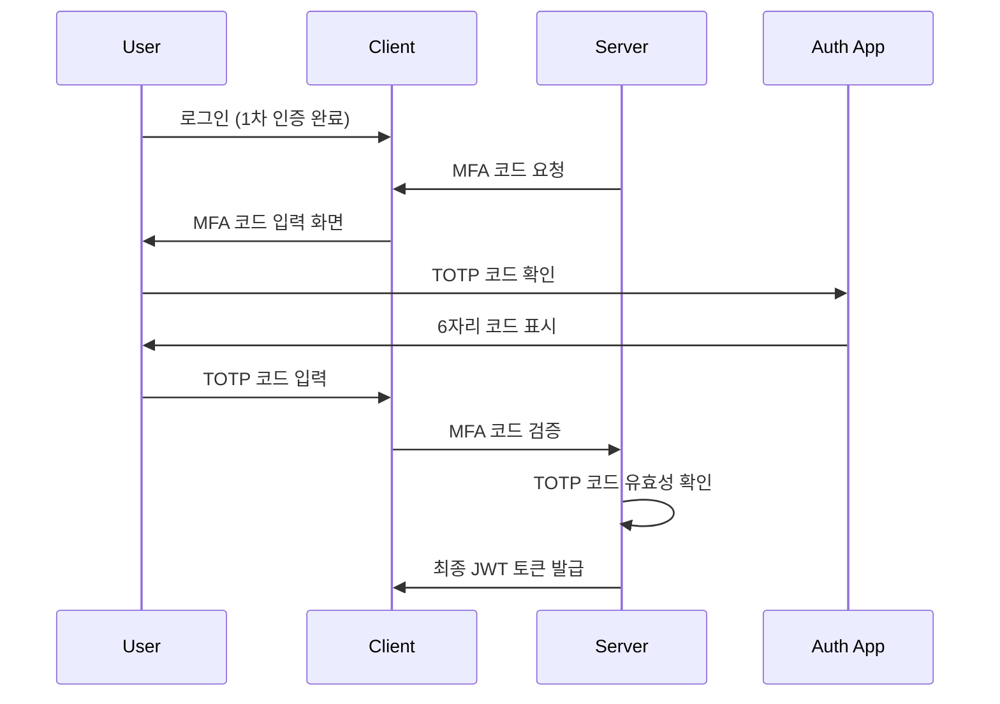

# 인증 시스템 가이드

## 📋 개요

실시간 협업 에디터는 **NextAuth.js 기반 다중 프로바이더 인증 시스템**을 사용합니다. 이메일/비밀번호, OAuth (Google, GitHub), 그리고 TOTP 기반 다중 인증(MFA)을 지원합니다.

## 🔐 지원하는 인증 방법

### 1. 이메일/비밀번호 인증

```typescript
provider: 'email';
```

**특징:**

- ✅ bcryptjs를 사용한 안전한 비밀번호 해싱
- ✅ 이메일 인증 필수
- ✅ 비밀번호 재설정 지원
- ✅ MFA 지원

**비밀번호 정책:**

- 최소 8자 이상
- 대소문자, 숫자, 특수문자 포함 권장
- 일반적인 비밀번호 패턴 차단

### 2. Google OAuth

```typescript
provider: 'google';
providerId: 'google_user_id';
```

**특징:**

- ✅ Google 계정으로 빠른 로그인
- ✅ 프로필 정보 자동 동기화
- ✅ 이메일 인증 자동 완료
- ✅ MFA는 Google 계정 설정 따름

### 3. GitHub OAuth

```typescript
provider: 'github';
providerId: 'github_user_id';
```

**특징:**

- ✅ GitHub 계정으로 개발자 친화적 로그인
- ✅ 프로필 정보 자동 동기화
- ✅ 이메일 인증 자동 완료
- ✅ MFA는 GitHub 계정 설정 따름

## 🛡️ 다중 인증 (MFA) 시스템

### TOTP (Time-based One-Time Password)

```typescript
mfaEnabled: true
mfaSecret: 'encrypted_secret'
mfaBackupCodes: ['code1', 'code2', ...] // 암호화된 백업 코드
```

**지원 앱:**

- Google Authenticator
- Authy
- 1Password
- Bitwarden

**설정 과정:**

1. 사용자가 MFA 활성화 요청
2. 서버에서 TOTP 시크릿 생성
3. QR 코드 생성 및 표시
4. 사용자가 인증 앱에 등록
5. 인증 코드 확인 후 MFA 활성화
6. 백업 코드 생성 및 제공

### 백업 코드 시스템

```typescript
// 10개의 일회용 백업 코드 생성
mfaBackupCodes: [
  'ABCD-EFGH-IJKL',
  'MNOP-QRST-UVWX',
  // ... 8개 더
];
```

**특징:**

- 각 코드는 1회만 사용 가능
- 사용된 코드는 즉시 무효화
- 모든 코드 사용 시 새로운 코드 세트 생성 권장

## 🔑 JWT 토큰 시스템

### 토큰 구조

```typescript
interface JWTPayload {
  sub: string; // 사용자 ID
  email: string; // 사용자 이메일
  name: string; // 사용자 이름
  provider: string; // 인증 프로바이더
  mfaVerified: boolean; // MFA 인증 여부
  iat: number; // 발급 시간
  exp: number; // 만료 시간
}
```

### 토큰 관리

- **Access Token**: 15분 만료
- **Refresh Token**: 30일 만료
- **자동 갱신**: Access Token 만료 5분 전 자동 갱신
- **보안 저장**: httpOnly 쿠키에 저장

## 🔄 인증 플로우

### 1. 이메일/비밀번호 회원가입



### 2. OAuth 로그인



### 3. MFA 인증



## 🔧 API 엔드포인트

### 회원가입

```typescript
POST /api/auth/signup
Content-Type: application/json

{
  "email": "user@example.com",
  "password": "securePassword123!",
  "name": "사용자 이름"
}

// 응답
{
  "success": true,
  "message": "회원가입이 완료되었습니다. 이메일을 확인해주세요.",
  "user": {
    "id": "user_123",
    "email": "user@example.com",
    "name": "사용자 이름",
    "emailVerified": false
  }
}
```

### 로그인

```typescript
POST /api/auth/signin
Content-Type: application/json

{
  "email": "user@example.com",
  "password": "securePassword123!"
}

// MFA가 활성화된 경우
{
  "requiresMFA": true,
  "tempToken": "temp_jwt_token"
}

// MFA가 비활성화된 경우
{
  "success": true,
  "user": { ... },
  "token": "jwt_access_token"
}
```

### MFA 설정

```typescript
POST /api/auth/mfa/setup
Authorization: Bearer jwt_token

// 응답
{
  "secret": "JBSWY3DPEHPK3PXP",
  "qrCode": "data:image/png;base64,iVBORw0KGgoAAAANSUhEUgAA...",
  "backupCodes": [
    "ABCD-EFGH-IJKL",
    "MNOP-QRST-UVWX",
    // ... 8개 더
  ]
}
```

### MFA 인증

```typescript
POST /api/auth/mfa/verify
Content-Type: application/json

{
  "tempToken": "temp_jwt_token",
  "code": "123456"  // TOTP 코드 또는 백업 코드
}

// 응답
{
  "success": true,
  "user": { ... },
  "token": "jwt_access_token"
}
```

## 🔒 보안 기능

### 세션 관리

```typescript
// 세션 정보 저장
interface Session {
  id: string;
  sessionToken: string;
  userId: string;
  expires: Date;
  createdAt: Date;
}
```

**특징:**

- 데이터베이스에 세션 정보 저장
- 로그아웃 시 세션 즉시 무효화
- 만료된 세션 자동 정리
- 동시 세션 수 제한 (선택적)

### 비밀번호 재설정

```typescript
POST /api/auth/forgot-password
{
  "email": "user@example.com"
}

// 재설정 링크 이메일 발송
// 토큰 유효기간: 1시간
```

### 계정 보안 이벤트

- 로그인 성공/실패 로그
- 비밀번호 변경 알림
- MFA 설정 변경 알림
- 새로운 기기 로그인 알림

## 🛠️ 개발자 도구

### 인증 상태 확인

```typescript
import { useSession } from 'next-auth/react';

function MyComponent() {
  const { data: session, status } = useSession();

  if (status === 'loading') return <p>Loading...</p>;
  if (status === 'unauthenticated') return <p>Access Denied</p>;

  return <p>Signed in as {session.user.email}</p>;
}
```

### 서버사이드 인증 확인

```typescript
import { authOptions } from '@/lib/auth';

import { getServerSession } from 'next-auth/next';

export async function getServerSideProps(context) {
  const session = await getServerSession(context.req, context.res, authOptions);

  if (!session) {
    return {
      redirect: {
        destination: '/auth/signin',
        permanent: false,
      },
    };
  }

  return {
    props: { session },
  };
}
```

### API 라우트 보호

```typescript
import { getServerSession } from 'next-auth/next';

export async function POST(request: Request) {
  const session = await getServerSession(authOptions);

  if (!session) {
    return new Response('Unauthorized', { status: 401 });
  }

  // 인증된 사용자만 접근 가능한 로직
}
```

## 🧪 테스트

### 인증 테스트

```typescript
// 회원가입 테스트
describe('Authentication', () => {
  it('should create new user with email/password', async () => {
    const response = await request(app).post('/api/auth/signup').send({
      email: 'test@example.com',
      password: 'securePassword123!',
      name: 'Test User',
    });

    expect(response.status).toBe(201);
    expect(response.body.user.email).toBe('test@example.com');
  });
});
```

### MFA 테스트

```typescript
// MFA 설정 테스트
it('should setup MFA for user', async () => {
  const response = await request(app)
    .post('/api/auth/mfa/setup')
    .set('Authorization', `Bearer ${userToken}`);

  expect(response.status).toBe(200);
  expect(response.body.secret).toBeDefined();
  expect(response.body.qrCode).toBeDefined();
  expect(response.body.backupCodes).toHaveLength(10);
});
```

## 🔄 마이그레이션 및 업그레이드

### 기존 사용자 MFA 마이그레이션

```sql
-- MFA 필드 추가 (이미 완료)
ALTER TABLE users ADD COLUMN mfa_enabled BOOLEAN DEFAULT FALSE;
ALTER TABLE users ADD COLUMN mfa_secret TEXT;
ALTER TABLE users ADD COLUMN mfa_backup_codes JSON;
```

### OAuth 프로바이더 추가

1. 새 프로바이더 설정 추가
2. 데이터베이스 스키마 확인
3. 사용자 매핑 로직 구현
4. 테스트 및 배포

---

**참고**: 인증 시스템은 보안의 핵심이므로 변경 시 충분한 테스트와 보안 검토가 필요합니다.
